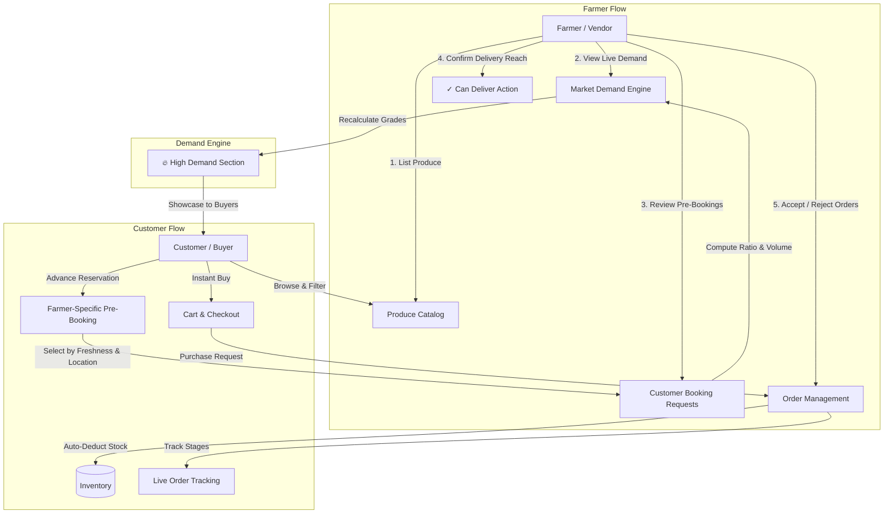

# FreshVeg — PS67 Farmer-to-Market Produce Selling Platform

[](https://flutter.dev)
[](https://dart.dev)
[](https://riverpod.dev)
[](https://firebase.google.com)
[](LICENSE)

A production-ready, direct farmer-to-buyer mobile marketplace built for **PS67**. FreshVeg eliminates middlemen by empowering farmers to list produce with harvest details, price per unit, and quantities, while enabling buyers to browse, filter, place purchase requests, track deliveries, and pre-book future harvests directly with specific local farmers.

---

## 📌 Problem Statement (PS67)

> **Create a platform where farmers list available produce for direct sale to buyers, cutting out middlemen.**  
> A produce listing should include crop type, quantity, price per unit, and harvest date. Buyers should be able to browse listings and place purchase requests.

### Core Functional Requirements
- **Farmer Produce Listings**: Farmers can create and manage listings with crop type, available quantity, price per unit, harvest date, and farm location.
- **Buyer Browsing & Filtering**: Buyers can discover produce filtered by category, crop type, or location.
- **Purchase Requests**: Buyers can submit purchase requests for listed quantities directly to farmers.
- **Dynamic Inventory Deduction**: Available inventory is automatically decremented as orders and purchase requests are confirmed.
- **Order Approval & Rejection**: Farmers have full control to accept or reject incoming purchase requests.
- **Sold-Out Handling**: When quantity reaches zero, produce is automatically marked out-of-stock and hidden from immediate buy availability.
- **Farmer Sales History & Analytics**: Farmers can review completed sales, revenue metrics, order statuses, and performance charts.
- **Advanced Demand Feature**: Customer advance pre-booking with farmer-specific freshness description and farm location selection, driving real-time marketplace demand grades (`HIGH`, `MODERATE`, `LOW`) and farmer delivery confirmation.

---

## 📱 Screenshots of Developed Pages

> The application provides dedicated, role-tailored experiences for both **Vendors (Farmers)** and **Users (Buyers/Customers)**.

### 🌾 1. Vendor / Farmer Experience (8 Screens)

| Screen | Description | Screenshot |
| :--- | :--- | :---: |
| **1. Vendor Dashboard** | Overview of store statistics, pending orders, delivered count, and total revenue. |  |
| **2. Inventory Management** | Real-time stock tracking with quick toggle for availability and stock counts. |  |
| **3. Add Produce Listing** | Create new produce with crop type, quantity (kg), unit price, harvest date, and photo. |  |
| **4. Produce Intelligence Card** | Detailed crop breakdown with price recommendation, demand analysis, and buyer matching. |  |
| **5. Market Demand Grades** | Real-time demand classification (`HIGH DEMAND`, `MODERATE`, `LOW`) computed from live customer pre-bookings. |  |
| **6. Customer Pre-Booking Requests** | Incoming customer-specific booking requests with requested kg, delivery address, and target harvest date. |  |
| **7. Confirm Delivery Reach** | Interactive farmer response dialog allowing vendors to confirm where and when they can deliver. |  |
| **8. Sales Analytics & History** | Comprehensive sales history, order stages (`pending` → `delivered`), and revenue tracking. |  |

---

### 🛒 2. User / Buyer Experience (8 Screens)

| Screen | Description | Screenshot |
| :--- | :--- | :---: |
| **1. Customer Home & Categories** | Browse fresh produce categorized by Root, Leafy, Gourds, etc., with dynamic search. |  |
| **2. High Demand Spotlight** | Live carousel spotlighting trending produce driven by real-time customer pre-booking volume. |  |
| **3. Produce Details & Stock** | Product detail page with unit price, available stock slider, and instant cart actions. |  |
| **4. Farmer & Freshness Selection** | Customer chooses a specific farmer based on harvest freshness description, distance, and ratings. |  |
| **5. Advance Pre-Booking Sheet** | Advance harvest request sheet with quantity chips, customer delivery address, and date picker. |  |
| **6. Cart & Purchase Request** | Review selected produce, specify delivery location, and submit purchase requests. |  |
| **7. Order Tracking Stages** | Live 4-stage visual progress tracker (`Pending` → `Confirmed` → `Out for Delivery` → `Delivered`). |  |
| **8. My Pre-Bookings Status** | Track advance booking status and view the farmer's delivery confirmation response note. |  |

---

## 🛠️ Technology Stack

| Layer | Technology | Purpose |
| :--- | :--- | :--- |
| **Framework** | **Flutter (Dart SDK `^3.11.0`)** | Cross-platform mobile client (Material 3) |
| **State Management** | **Flutter Riverpod (`v2.5.1`)** | Declarative, reactive state & real-time stream providers |
| **Database** | **Cloud Firestore** | Real-time NoSQL database for produce, orders, users & pre-bookings |
| **Authentication** | **Firebase Auth** | Role-based authentication (Farmer & Buyer) |
| **Storage** | **Firebase Storage** | Cloud storage for produce photos |
| **Navigation** | **GoRouter (`v14.2.7`)** | Deep linking, URL routes, and role-based redirect guards |
| **Charts & UI** | **FL Chart, Flutter Animate, Shimmer** | Interactive sales charts, loading skeletons, and micro-animations |
| **Typography** | **Google Fonts (Poppins)** | Modern typography across all screens |
| **Localization** | **AppTranslations & LocaleProvider** | Bilingual support (English & Tamil) |
| **Offline Cache** | **SharedPreferences & ConnectivityPlus** | Offline resilience & session caching |

---

## 📐 Architecture & System Workflow



---

## 🚀 Setup & Run Instructions

### 1. Prerequisites
- **Flutter SDK**: `^3.11.0` or higher ([Install Flutter](https://flutter.dev/docs/get-started/install))
- **Dart SDK**: `^3.11.0`
- **Android Studio / VS Code** with Flutter & Dart extensions
- **Connected Device / Emulator**: Android device running Android 7.0+ (API 24+) or iOS Simulator

### 2. Clone the Repository
```bash
git clone https://github.com/ssukivarsan-prog/BIZ-HACK-26.git
cd BIZ-HACK-26
```

### 3. Install Dependencies
```bash
flutter pub get
```

### 4. Run Automated Tests
Verify demand calculation logic, cart notifier, order models, and pre-booking suites:
```bash
flutter test
```
*(All 43 unit and widget tests pass with 0 errors).*

### 5. Launch the Application
Run in debug mode on your connected device or emulator:
```bash
flutter run
```

### 6. Build APK (Android)
To generate an installable Android APK:
```bash
# Debug APK
flutter build apk --debug

# Release APK
flutter build apk --release
```
The compiled APK will be located at:
`build/app/outputs/flutter-apk/app-debug.apk`

---

## 📂 Project Directory Structure

```
lib/
├── auth/                       # Role-based authentication & splash
│   ├── screens/                # Login, Signup, Onboarding, Splash
│   └── widgets/                # Auth textfields & custom buttons
├── customer/                   # Buyer / Customer features
│   ├── screens/                # Home, Details, Cart, Tracking, Profile
│   └── widgets/                # HighDemandSection, PreBookingSheet, MyPreBookingsSheet
├── vendor/                     # Farmer / Vendor features
│   ├── screens/                # Dashboard, Inventory, AddProduce, Analytics
│   └── widgets/                # MarketDemandCard, SmartInsightCard, BuyerMatching
├── models/                     # Data models (PreBooking, Vegetable, Order, User)
├── services/                   # Riverpod services (DemandCalc, PreBooking, Cart, Order)
├── theme/                      # AppTheme, colors, and Poppins typography
└── utils/                      # GoRouter router configuration & AppLogger
```

---

## 👥 Contributors
- **Sukivarsan S** ([GitHub Profile](https://github.com/ssukivarsan-prog))
- Project developed for **BIZ-HACK-26 / PS67**.
